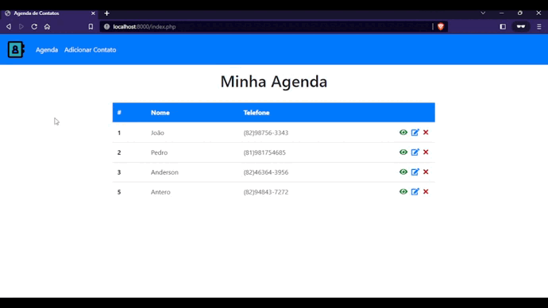

# Projeto Agenda com PHP e Sql Server
Projeto feito para aplicar os conceitos de PHP na Web e conexão com o banco de dados para realizar operações CRUD (Create, Read, Update, Delete).  



## Principais conceitos aplicados:
• Gerar templates com **include_once**;  
• Fazer conexão com banco de dados Sql Server através da classe de **PDO**;  
• Realizar as operações básicas do Sql, o famoso CRUD;  
• Trabalhar com sessões para informar mensagens dinâmicas;  
• Realizar redirecionamentos com a função **header**;  


## Como utilizar?
Faça um clone da aplicação;  
Abra o projeto no seu editor de texto;  
Acesse a pasta do projeto e execute o seguinte comando no terminal:
```
    php -S localhost:8000
```